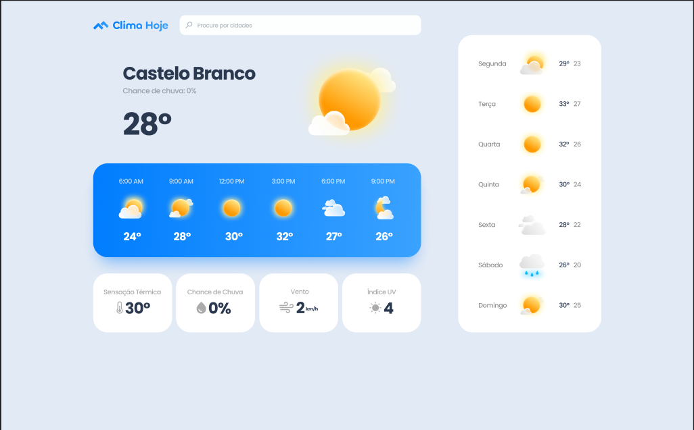
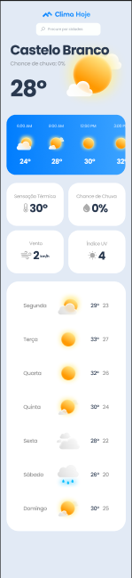

# 🌤️ Clima Hoje - Weather App



Uma interface de aplicativo meteorológico moderna e responsiva desenvolvida com foco em design clean e experiência de usuário intuitiva usando apenas HTML5 e CSS3.

## 📋 Sobre o Projeto

O **Clima Hoje** é um projeto de interface front-end que demonstra habilidades avançadas em HTML e CSS. O projeto apresenta um layout elegante de um aplicativo meteorológico com design responsivo, gradientes modernos e uma estrutura visual bem organizada para exibição de dados climáticos.

### ✨ Características Principais

- **Interface Moderna**: Design clean com gradientes suaves e elementos visuais atraentes
- **Layout Responsivo**: Adaptável a diferentes tamanhos de tela
- **Design System**: Componentes visuais consistentes e bem estruturados
- **CSS Avançado**: Uso de Flexbox, Grid, gradientes
- **Tipografia**: Hierarquia visual clara e legível

## 🛠️ Tecnologias Utilizadas

- **HTML5**: Estrutura semântica e moderna
- **CSS3**: Estilização avançada com propriedades modernas
- **Flexbox & Grid**: Layouts responsivos e flexíveis
- **CSS Variables**: Sistema de cores e espaçamentos consistente
- **Media Queries**: Responsividade para diferentes dispositivos

## 📱 Elementos Visuais

### Componentes Implementados

- Interface principal com temperatura e ícones meteorológicos
- Previsão horária com layout horizontal
- Cards informativos para dados meteorológicos
- Previsão semanal com design consistente
- Sistema de cores harmoniosa e moderna

### Técnicas CSS Utilizadas

- Gradientes lineares e radiais
- Box-shadows para profundidade
- Border-radius para elementos suavizados
- Transições suaves nos elementos
- Layout responsivo com breakpoints

## 🚀 Como Visualizar

1. **Clone o repositório**

   ```bash
   git clone https://github.com/mamadusama/projeto-clima-frontend.git
   cd projeto-clima-frontend
   ```

2. **Abra no navegador**

   ```bash
   # Simplesmente abra o arquivo index.html
   # em qualquer navegador moderno
   open index.html
   ```

## 📸 Screenshots

### Desktop


### Mobile



## 🔧 Estrutura do Projeto

```
projeto-clima-frontend/
├── index.html          # Estrutura principal HTML
├── styles/
│   ├── style.css      # Estilos principais
│   └── responsive.css # Media queries
├── images/        # Imagens e screenshots
└── README.md          # Documentação
```

## 🌟 Destaques Técnicos

- **CSS Puro**: Interface completamente construída com HTML e CSS
- **Design Responsivo**: Adaptável a diferentes resoluções sem frameworks
- **Performance**: Carregamento rápido sem dependências externas
- **Código Limpo**: Estrutura organizada e semântica
- **Cross-browser**: Compatível com navegadores modernos
- **Acessibilidade**: Boas práticas de HTML semântico

## 📈 Próximas Implementações

- [ ] Adicionar JavaScript para interatividade
- [ ] Integração com API de dados meteorológicos
- [ ] Animações CSS mais avançadas
- [ ] Modo escuro/claro
- [ ] Mais variações de layout responsivo
- [ ] Otimização para PWA

## 🤝 Contribuições

Contribuições são sempre bem-vindas! Sinta-se à vontade para:

1. Fazer fork do projeto
2. Criar uma branch para sua feature (`git checkout -b feature/AmazingFeature`)
3. Commit suas mudanças (`git commit -m 'Add some AmazingFeature'`)
4. Push para a branch (`git push origin feature/AmazingFeature`)
5. Abrir um Pull Request

## 📝 Licença

Este projeto está sob a licença MIT. Veja o arquivo [LICENSE](LICENSE) para mais detalhes.

## 📞 Contato

**Mamadu Sama** - [mamadusama12@email.com](mailto:seu-email@email.com)

**LinkedIn**: [mamadusama](https://linkedin.com/in/mamadusama)

**Portfolio**: [mamadusama](https://mamadusama.com)

**Link do Projeto**: [https://github.com/mamadusama/projeto-clima-frontend](https://github.com/mamadusama/projeto-clima-frontend)

---

⭐ Se este projeto te ajudou, considere dar uma estrela no repositório!

_Desenvolvido com ❤️ e ☕_
